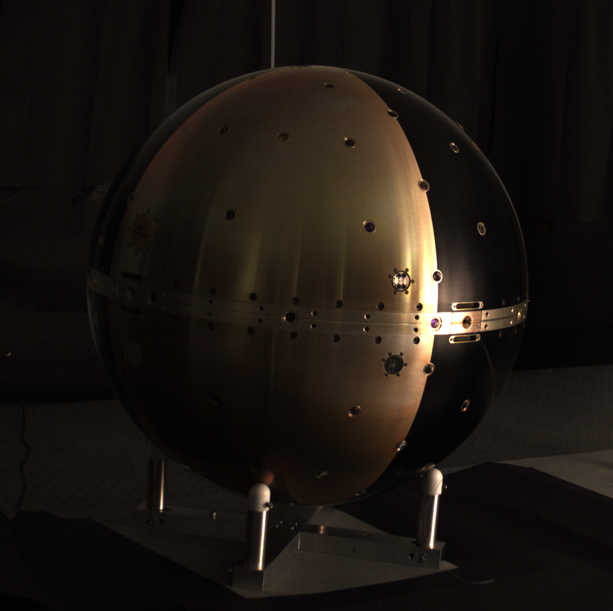

Thanks to Andy Nicholas at Naval Research Labs (NRL), OSCOM was able to make ground truth optical measurements of the 0.5 meter diameter SpinSat satellite before launch. The spherical satellite is outfitted with corner cubes for laser tracking and LEDs which can be commanded to flash from the ground. Ground truth images were collected in the B, V, R, and I photometric bands, but specular reflection off the black anodized and gold irridite aluminum spacecraft surfaces dominated the optical signature.

Results were presented in the paper [_SpinSat Mission Ground Truth Characterization_](http://www.dtic.mil/get-tr-doc/pdf?AD=ADA616431) at the Advanced Maui Optical and Space Surveillance Technologies Conference (AMOS Tech) 2014. Launch is expected in the summer of 2014.

{: .center-caption}
{: .center-image width="50%"}
NRL SpinSat illuminated by a quartz halogen lamp during ground truth characterization.
